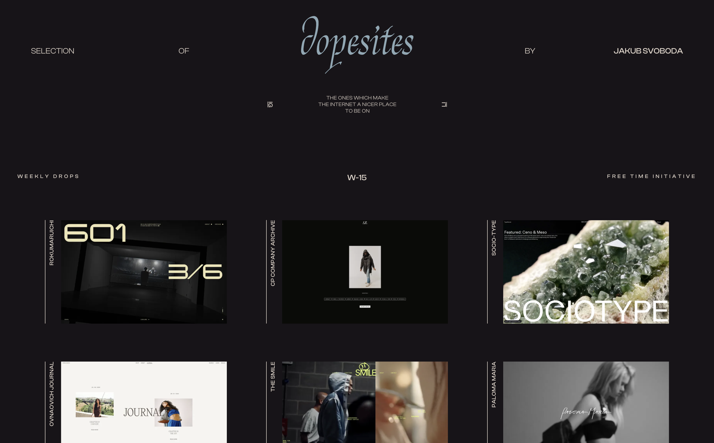

# vh-calculation-fix

Reliable viewport height CSS variables for real devices and in‑app browsers. Exposes `--svh` and `--lvh` to replace broken `vh` behavior.

- Provides reliable `--svh` and `--lvh` CSS variables that behave correctly in in‑app browsers and WebViews.
- Fixes broken `vh` behavior in environments like Instagram, WhatsApp, Telegram, and generic WebViews.
- Demo: `https://vanilla-dopesites.vercel.app/`
- Design reference: Figma `https://www.figma.com/design/ymd9XlC1rq8OJIOJv7zNRV/DOPESITES?node-id=0-1&t=GdkJITg1mUZwE1nP-1`

[badges here]

## Why

- Default `vh` is often inaccurate in real apps because in‑app browsers and WebViews overlay UI chrome (address bars, toolbars, keyboard) that shifts the visible viewport.
- This causes cut‑off sections, content jumps on scroll, and unstable layouts that are expensive to debug across apps.
- The library computes the actually visible height and updates on `resize`, `orientationchange`, and `visualViewport.resize` so spacing and typography remain consistent.
- Saves developer time by removing per‑app hacks and manual exceptions; you use CSS variables everywhere and your layout stays stable.

## Quick Start

### Installation

- npm: `npm install vh-calculation-fix`
- yarn: `yarn add vh-calculation-fix`

### Minimal JS

```ts
import { initViewportHeight } from 'vh-calculation-fix';

initViewportHeight();
```

### Minimal CSS

```css
.hero {
  min-height: var(--lvh);
  display: grid;
  place-items: center;
}
```

## Usage

### Vanilla JS

- With options:

```
initViewportHeight({
  useMinOnIOS: true,
  updateOnFocus: true,
  onUpdate: (svh, lvh) => {
    // handle updates
  }
});
```

When to use:
- Hero sections that must truly fill visible height.
- Forms/pages with keyboards that would otherwise cause jumps.
- Routes that need consistent spacing across different app browsers.

### React

```
import { useEffect } from 'react';
import { initViewportHeight } from 'vh-calculation-fix';

export function App() {
  useEffect(() => {
    const stop = initViewportHeight({ updateOnFocus: true });
    return () => stop();
  }, []);
  return <div style={{ minHeight: 'var(--lvh)' }}>...</div>;
}
```

When to use:
- App shells and layouts that must adapt to visible height.
- Pages with keyboard interactions or dynamic toolbars.

### CSS spacing system

```
:root {
  /* Example scale unit based on visible height */
  --sp-y-127: calc(127 / 1117 * var(--lvh));
}

.section {
  padding-block: var(--sp-y-127);
}
```

When to use:
- Section spacing, vertical rhythm, and type scales that should remain consistent across display modes.

## What `--svh` and `--lvh` represent

- `--svh`: safe viewport height based on `window.innerHeight` for stable content sizing.
- `--lvh`: large/visible viewport height reflecting real on‑screen space using `visualViewport.height` plus platform rules.
- Both update on viewport changes so CSS scales fluidly with the actual visible height.
- Variable names are customizable via options.
 - On iOS, `useMinOnIOS` caps `--lvh` with `min(visualViewport.height, innerHeight)` to avoid overexpansion.

## API

- `initViewportHeight(options?)`: initializes and subscribes to viewport changes, returns a cleanup function.
- `setViewportHeight(options?)`: alias to `initViewportHeight`.

### Options

```ts
type Options = {
  forceInApp?: boolean;
  useMinOnIOS?: boolean;
  variableNames?: { svh?: string; lvh?: string };
  apps?: RegExp;
  updateOnFocus?: boolean;
  onUpdate?: (svh: number, lvh: number) => void;
};
```

- `forceInApp`: Force in‑app logic regardless of UA detection (testing/debugging).
- `useMinOnIOS`: Prevent overexpansion on iOS; recommended for mobile Safari.
- `variableNames`: Override CSS variable names if your project uses custom tokens.
- `apps`: Extend UA detection for additional app browsers/WebViews if required.
- `updateOnFocus`: Recalculate on focusin/focusout; helps pages with inputs/keyboard.
- `onUpdate`: Callback invoked after updates with numeric `svh`/`lvh` values.

## Troubleshooting

- Variables aren’t updating — Ensure `initViewportHeight()` runs once on page/app mount before styles that use `var(--lvh)`.
- Content jumps when keyboard opens — Set `updateOnFocus: true` to recalc on focus events and stabilize form views.
- Safari iOS overexpands — Keep `useMinOnIOS: true` so visible height is capped to avoid overflows.
- `visualViewport` missing — Library falls back to `innerHeight`; layouts remain consistent on older devices.

## Compatibility

Targets modern browsers that support `visualViewport` and gracefully falls back to `innerHeight` when unavailable. Explicitly handles in‑app browsers/WebViews (Instagram, WhatsApp, Telegram, generic WebViews) and includes iOS‑aware logic.

- Modern browsers (with `visualViewport`)
- Fallback to `innerHeight` where needed
- In‑app browsers/WebViews (Instagram, WhatsApp, Telegram, etc.)

## Build & Scripts

- `npm run build`: Emits ESM/CJS bundles and type definitions to `dist`.
- `npm run test`: Runs unit tests with Vitest.
- `npm run lint`: Lints the codebase with ESLint.
- `npm run typecheck`: TypeScript type checking with `tsc --noEmit`.

## Examples & Demos

- Live demo: https://vanilla-dopesites.vercel.app/
- Figma design: https://www.figma.com/design/ymd9XlC1rq8OJIOJv7zNRV/DOPESITES?node-id=0-1&t=GdkJITg1mUZwE1nP-1

Real‑world examples:
- Steel Cut — px/rem vs fluid `--lvh` across macOS display modes.
- Dopesites — fluid spacing/typography consistent across resolutions.
- shinpaku.co — demonstrates broken default `vh` inside in‑app browsers on scroll.

Screenshots:
- 
- 
- 
- 

These examples show that raw `vh` can misrepresent visible space and cause layout instability in apps, while a visible‑height system keeps designs predictable under real device conditions. The approach stabilizes hero sizing, spacing, and form behavior across app browsers and WebViews.

## Notes / Background

- Pixels and rems work in fixed steps; they fail to adapt across display modes.
- Raw `vh` breaks in popular in‑app browsers because it ignores app chrome, leading to cropping and layout jumps.
- This library replaces raw `vh` with reliable variables derived from the visible viewport, keeping your design consistent across browsers and apps.
- Preference: `vh` supports vertical rhythm; `vw` is useful for horizontal sizing—choose based on design.

## License

MIT
